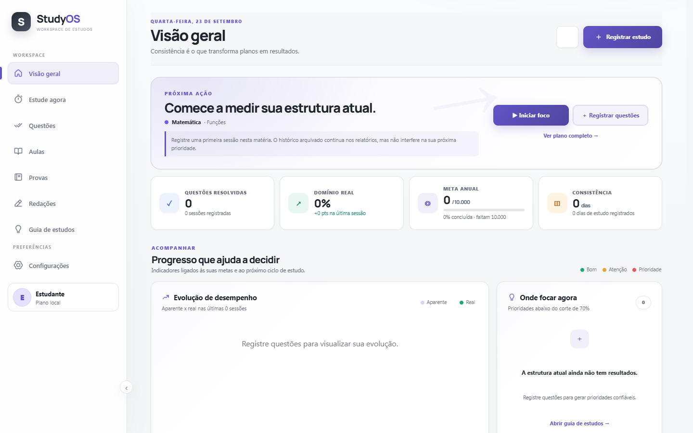
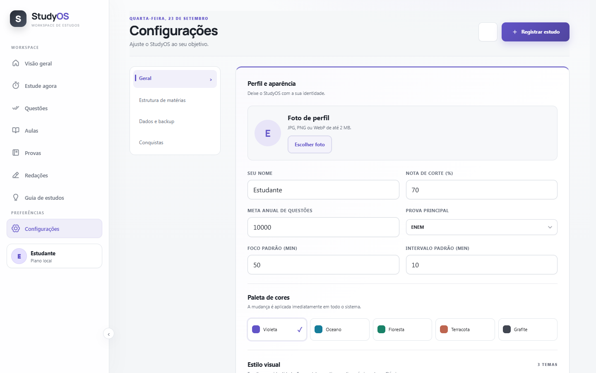

# 📚 StudyOS

> Seu workspace de estudos para planejar melhor, estudar com foco e transformar registros em decisões.

[](https://github.com/danielcdesk/StudyOS/releases)
[](https://github.com/danielcdesk/StudyOS/releases)
[](https://github.com/danielcdesk/StudyOS/releases)
[](#-transparência)

O **StudyOS** organiza o ciclo completo de estudo em um só lugar: planejamento, foco, questões, aulas, provas, redações e revisão. O projeto é local-first, responsivo e pode ser usado pelo navegador ou em uma janela própria no Windows.

🔗 **Demo online:** [studyos-luiz-2026.opao6394.chatgpt.site](https://studyos-luiz-2026.opao6394.chatgpt.site/)

## ✨ O que já existe

- 📊 **Visão geral** com metas, consistência, evolução e indicadores de domínio.
- 🎯 **Estude agora** para iniciar uma sessão de foco e registrar o que foi feito.
- ✅ **Banco de questões** com acertos, erros, dúvidas, chutes e questões puladas.
- 🎬 **Aulas** planejadas e concluídas, com histórico de duração.
- 📝 **Provas e redações** com métricas explicáveis.
- 🧭 **Guia de estudos** com prioridades calculadas a partir dos seus próprios registros.
- 🗂️ **Estrutura de matérias** por categoria, matéria e assunto.
- ⏱️ **Pomodoro persistente** e registro de tempo de foco.
- 💾 **Backup JSON** com prévia, validação e opção de desfazer a última importação.
- 🌗 **Temas e paletas** para adaptar o ambiente ao seu jeito de estudar.
- 🔒 **Privacidade por padrão:** os dados de estudo ficam no dispositivo durante o uso normal.

## 🖼️ Prévia do aplicativo

As imagens abaixo foram capturadas da versão pública do StudyOS e mostram o painel principal e a área de configurações.

| Visão geral | Configurações |
| --- | --- |
|  |  |

## 📦 Downloads e releases

Os instaladores e o APK ficam na página de [**Releases**](https://github.com/danielcdesk/StudyOS/releases).

| Plataforma | Arquivo | Uso |
| --- | --- | --- |
| 🪟 Windows 11 | `StudyOS Setup 1.0.0.exe` | Instalador recomendado |
| 🪟 Windows 11 | `StudyOS 1.0.0.exe` | Versão portátil |
| 📱 Android | `StudyOS-Android.apk` | APK experimental para testes |

> ⚠️ O APK experimental carrega a mesma experiência web publicada. Para instalar no Android, habilite a instalação de apps de fontes permitidas e confira a origem do arquivo antes de abrir.

### Atualizações sem reinstalar

A interface é carregada a partir da versão web publicada. Assim, correções visuais e melhorias do front-end podem chegar automaticamente na próxima abertura do app. Alterações no invólucro nativo — permissões, ícone, janela ou ponte Android/Windows — exigem uma nova build e um novo release.

Consulte o [histórico de releases](RELEASES.md) para ver o que mudou e conferir os hashes SHA-256 dos artefatos.

## 🔒 Privacidade e dados

- O StudyOS não exige conta para registrar seus estudos.
- O banco local do aplicativo Windows fica em:

  ```text
  %APPDATA%\\br.com.studyos.app\\studyos.db
  ```

- Backups pessoais e bancos reais não devem ser enviados para o GitHub.
- Exporte um backup JSON em **Configurações → Dados e backup** antes de trocar de dispositivo.

## 🛠️ Desenvolvimento local

Pré-requisitos: Node.js, pnpm e, para o desktop, Rust/Cargo com as ferramentas de compilação C++ do Windows.

```powershell
pnpm install
pnpm run verify
pnpm run desktop:dev
```

Para gerar o instalador Windows:

```powershell
pnpm run desktop:build
```

O artefato Tauri é gerado em `src-tauri/target/release/bundle/`.

## ✅ Qualidade

```powershell
pnpm run verify
```

O comando executa a auditoria das telas, estados principais, armazenamento local, migração, busca e contrato do desktop. Antes de distribuir uma build, teste o instalador em um Windows limpo e confirme que nenhum dado pessoal entrou no pacote.

## 🧩 Estrutura do projeto

```text
StudyOS/
├─ public/             # Interface web, temas, componentes e dados de exemplo
├─ src-tauri/          # Aplicativo Windows desktop (Tauri + SQLite)
├─ data/               # Exemplos seguros para desenvolvimento
├─ tests/              # Auditorias automatizadas
├─ RELEASES.md         # Registro de versões e checksums
└─ README.md           # Este documento
```

## 🤝 Como contribuir

1. Faça um fork do projeto.
2. Crie uma branch curta para sua alteração.
3. Rode `pnpm run verify`.
4. Abra um pull request descrevendo o problema, a solução e como você testou.

Issues e sugestões são bem-vindas, principalmente quando incluem passos para reproduzir o problema e capturas sem dados pessoais.

## 🧠 Transparência

Este aplicativo foi desenvolvido com apoio de **inteligência artificial (IA)**, com revisão humana, decisões técnicas humanas e testes antes da distribuição. A IA participou da exploração de ideias, implementação e documentação; ela não substitui revisão, validação de segurança ou responsabilidade sobre o uso do software.

O StudyOS é um projeto experimental/educacional. Faça backups dos seus dados e valide qualquer informação importante antes de tomar decisões acadêmicas.

## 📄 Licença

Ainda não há uma licença de código aberto definida para este repositório. Até que uma licença seja adicionada, todos os direitos permanecem reservados ao autor.
